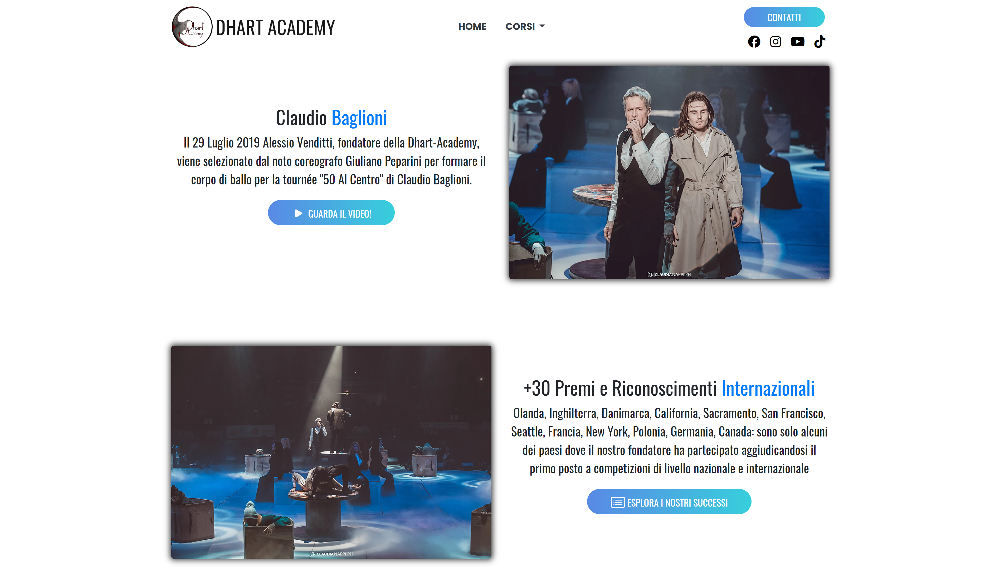
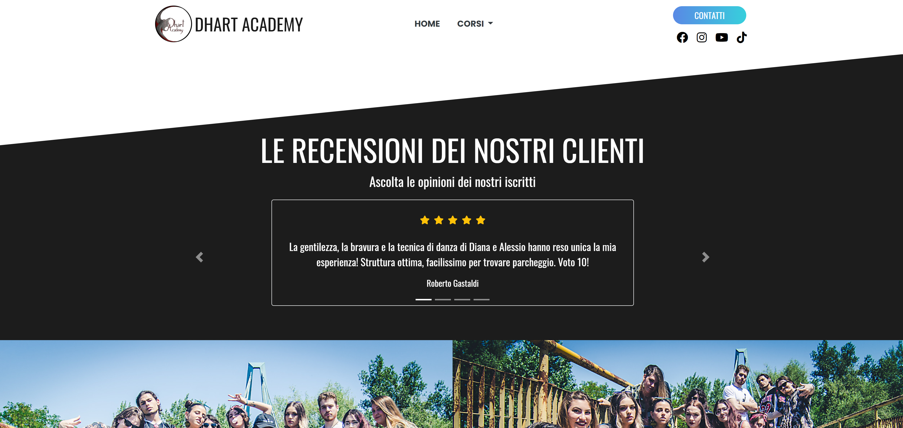
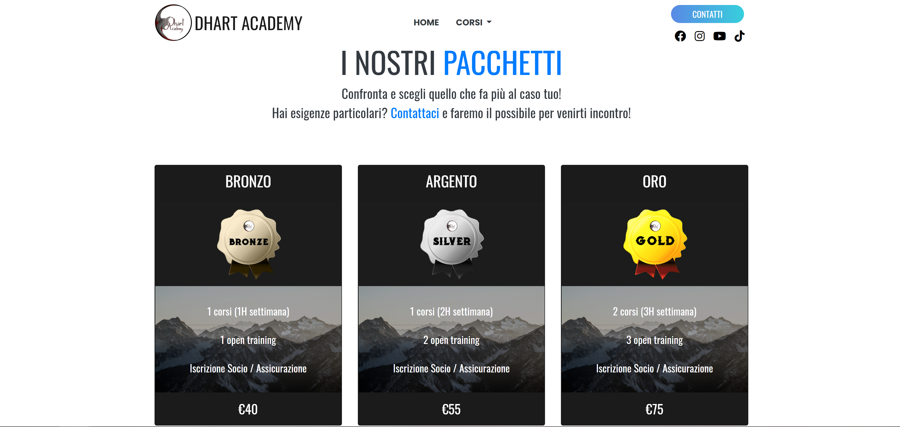
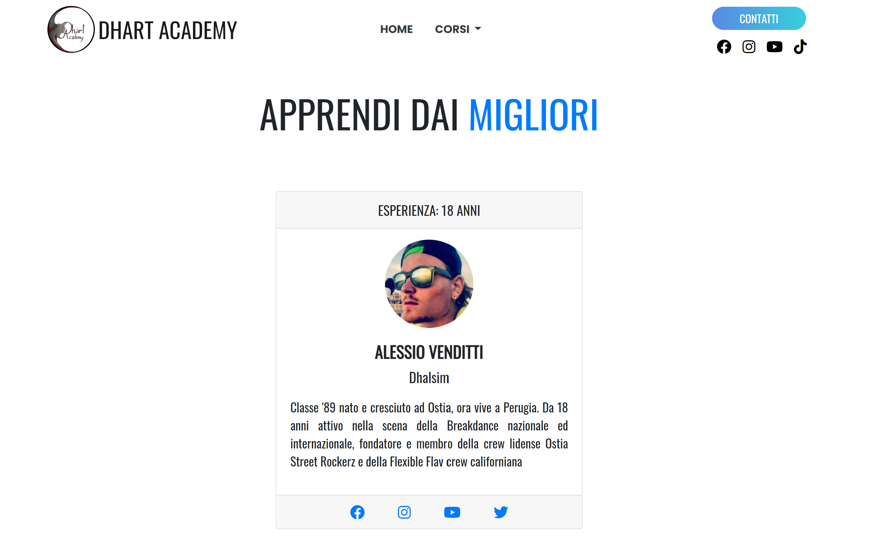
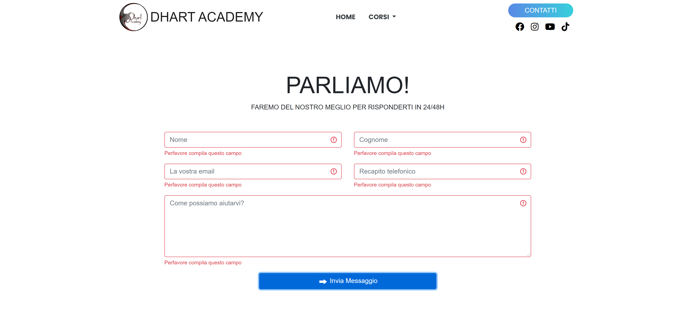

# Dhart-Academy
This is a Spring MVC app for a dance academy in Perugia, Italy. It is a Work in Progress.

To build this project I have used Spring Boot, Thymeleaf, MongoDB, Bootstrap 4.5

Note: the app won't run properly locally due to the need to hide database URI in the application.properties; the website will be live soon.

## Screenshots

  
Home page | slide-show

  
  
  

  
Home page | experiences 

  
  
  

  
Home page | structure 

  
  
  

  
Home page | reviews 

  
  
  

  
Home page | footer 

  
  
  

  
Course page | breakdance  

  
  
  

  
Course page | breakdance | packages  

  
  
  

  
Course page | breakdance | teacher  

  
  
  

  
Contact page 

  
  
  

  
Contact page | contact form  

  
  
  

